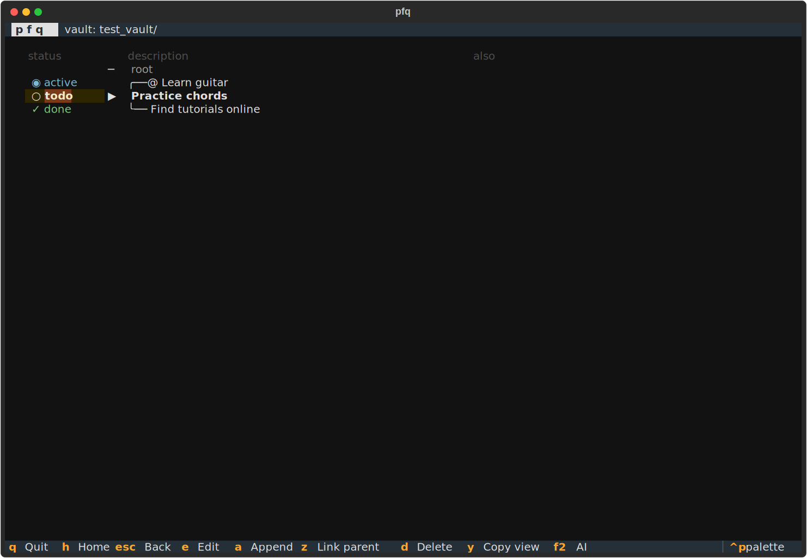

# PourFaireQuoi (pfq)

**pfq** — the personal task manager for *why* and *how*.

Every task has four questions: *what*, *why*, *how*, and *when*.
Most tools handle *what* (todo list) and *when* (calendar). pfq handles *why* and *how*.

Navigating up always answers *why* — every action is connected to the goal behind it.
Navigating down always answers *how* — every goal decomposes into the steps that achieve it.

**Neither a flat list nor a tangled graph.** pfq shows only your local neighbourhood — two levels up, two levels down — rendered as a tree. Structure is always visible; the rest of the graph stays out of the way.


```
  ╭──@ Learn guitar
  ├──@ keep a creative practice
▶ Practice chords
  ├──○ Find tutorials online   (done)
  ├── Learn a first song
  │   ├──○ Pick a simple song
  │   ╰──○ Play it slowly first
  ╰──○ 1h friday morning
```





More screenshots: [home](screenshots/01_home.svg) · [companion](screenshots/03_companion.svg) · [edit modal](screenshots/04_edit_modal.svg) · [delete modal](screenshots/05_delete_modal.svg)

---

## Data model

### Nodes and links

A node is a single unit of thought — a goal, a project, a task, an idea. All share the same structure; their role is determined by position in the graph.

Links are directional: `how` (downward, decomposition) and `why` (upward, motivation — derived by reversing `how`, never stored).

The graph is a DAG: a node can have multiple parents, allowing the same concept to belong to several perspectives simultaneously.

### Node role (derived from structure)

| Symbol | Role | Meaning |
|--------|------|---------|
| `@` | root | no parents — a perspective anchor |
| `<` | middle | has both parents and children — structure |
| `○` | leaf | no children — an actionable atom |

### Node lifecycle

A node is either **open** or **closed** (`closed_at` set). Closing is the only state transition that counts as activity.

Optional tracking fields:

| Field | Purpose |
|-------|---------|
| `opened_at` | When the node became active (user-set, can be past or future) |
| `closed_at` | When it was closed (set on close) |
| `close_reason` | `done` or `discarded` |
| `estimated_closing_date` | Target close date |
| `update_period` | Check-in cadence in days |
| `description` | The node title |
| `comment` | Free-form note |

### Computed fields (not stored)

| Field | Meaning |
|-------|---------|
| `_last_active` | Most recent `closed_at` among all descendants (propagated bottom-up) |
| `_last_update` | Last period boundary: `opened_at + (elapsed // period) * period` |
| `_is_active` | `_last_active >= _last_update`; `None` if still in first period |
| `_is_overdue` | `today > estimated_closing_date` |

A "scheduled" node is simply open with a future `opened_at` — no special type needed.

### YAML format

```yaml
description: Build a vintage radio
opened_at: 2026-01-15
estimated_closing_date: 2026-06-01
update_period: 14
comment: |
  Started from a 1952 Philips chassis.

how:
- target_node: KLOP45_get_the_case
- target_node: OAAP11_repair_capacitors
```

One YAML file per node. Filename: `{node_id}_{slug}.yaml`. The `node_id` is a 6-character random prefix used for link resolution.

---

## UI

### Columns

| Column | Content | Editable |
|--------|---------|----------|
| status | `▸ active` / `· forgotten` / `! overdue` / `✓ done` / `✗ discarded` | `e` |
| description | tree + node title | `e` |
| when | target close date — `→` weeks `⇒` months `☽` years `☀` | `e` |
| update | `↻ next check-in` date | `e` |

`e` on `status` toggles open/closed (with `done`/`discarded` choice on close).
`e` on `when` edits `estimated_closing_date`. `e` on `update` edits `opened_at` + check period.

### Views

**Home** — all root nodes (`@`) with their direct children.

**Node view** — local neighbourhood of the selected node, depth 2 in each direction:

```
  ─ root
  ╭── grandparent
  ├── parent
▶ Current node
  ├── child 1
  │   ├──< middle grandchild
  │   ╰──○ leaf grandchild
  ╰──○ leaf child
```

### Keyboard shortcuts

| Key | Action |
|-----|--------|
| `h` | Home |
| `Esc` | Back |
| `q` | Quit |
| `Enter` | Open node |
| `e` | Edit focused cell |
| `a` | Add child node (Tab to toggle close-immediately) |
| `z` | Link to parent (search or create) |
| `d` | Delete / unlink (multi-choice modal) |
| `Shift+↑` / `Shift+↓` | Reorder children |
| `s` | Search / jump to node |
| `y` | Copy view to clipboard |

### Date input

The date parser accepts:

| Input | Meaning |
|-------|---------|
| `2026-06-01` | ISO date |
| `today`, `tomorrow`, `yesterday` | named |
| `3d`, `2w`, `2wk`, `1m`, `1mo`, `1y` | relative future |
| `in 3d`, `in 2w` | explicit future |
| `3d ago`, `2w ago`, `1m ago` | relative past |
| `fri`, `wed` | next occurrence of weekday |
| `fri 18`, `thu 30` | nearest matching weekday + day |
| `may 14`, `jun 21` | nearest matching month + day |
| `jun.`, `apr.` | first of that month (future-preferring) |
| `jun. 2027` | first of month, specific year |

Live feedback shows the parsed ISO date in green, or `? unrecognised` in red.

---

## Architecture

Three-layer separation: **model → view → render**.

| File | Role |
|------|------|
| `pfq/model.py` | `Node` dataclass, `NodeGraph`, `compute_lifecycle()` |
| `pfq/disk_io.py` | File I/O: load/save vault, create/delete nodes |
| `pfq/config.py` | `FIELDS`, `INFERRED_STATE_STYLES`, `STATUS_GLYPHS` |
| `pfq/dates.py` | `format_date()`, `parse_date()` — logarithmic precision |
| `pfq/view.py` | `ViewRow`, `build_node_view()`, `build_home_view()` |
| `pfq/render.py` | `render_to_table()`, `render_to_text()` |
| `pfq/modals.py` | All modal screens |
| `pfq/app.py` | `PfqApp` — navigation, actions, lifecycle |

---

## Setup

```bash
pip install -e .
pfq                  # open default vault (data/)
pfq /path/to/vault   # open a specific vault
venv/bin/pytest      # run tests
```

---

## Credits

Built with the assistance of [Claude](https://claude.ai) (Anthropic).
