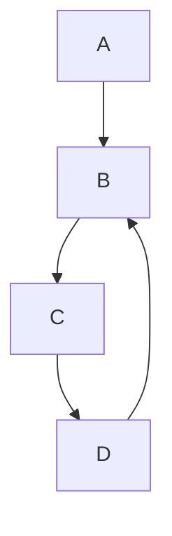
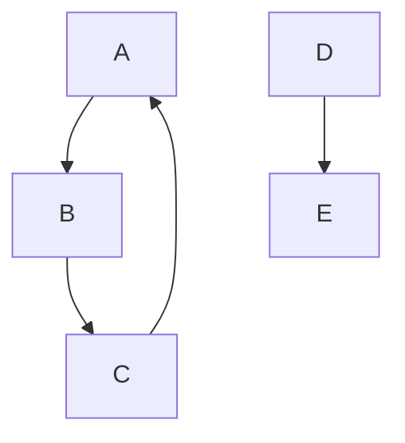
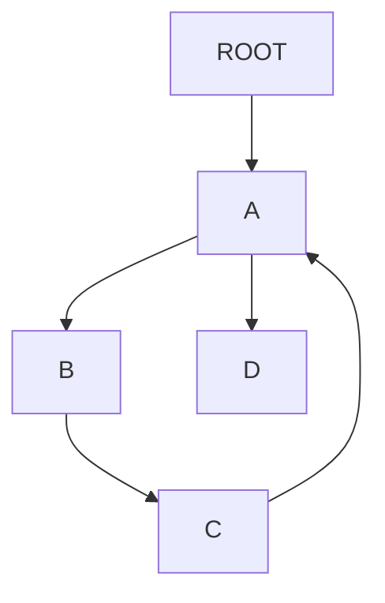
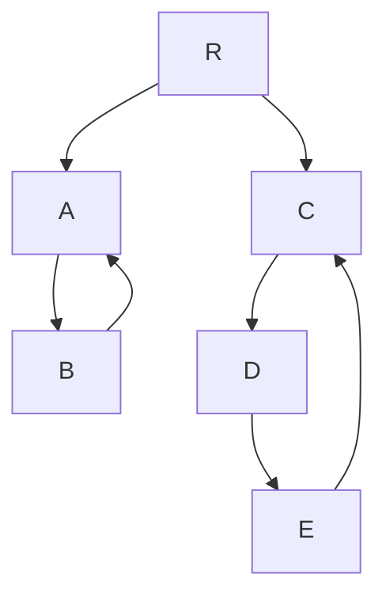
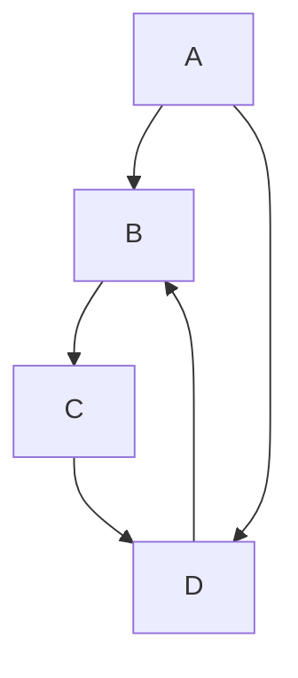
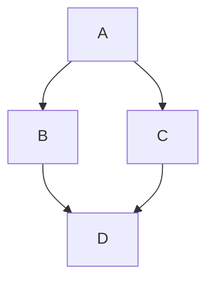

# Dealing with cycles in the vault graph

Cycles are semantically meaningful (self-reinforcing loops, growth feedback) and should not be silently broken. The problem is purely a rendering one.

## Proposed approach

Keep cycles in the graph, make the app robust to them:

1. **`compute_lifecycle`** — nodes stuck in a cycle never enter Kahn's queue; leave their lifecycle fields as `None` (already the default).
2. **`get_roots`** — after normal root detection, surface cycle-only nodes as orphan roots so they remain reachable from the home view.
3. **`_dfs_tree`** — detect back-edges and yield them with a `role="cycle"` marker instead of silently dropping them.
4. **`render.py`** — render cycle rows with a distinct visual, e.g. `⟲ AB0001 (practice chords)` in a muted color, no expand.

## Cases to handle

**1. Simple self-reinforcing loop embedded in a larger tree**

Navigating to B: child tree shows C → D → *⟲ B*. Parent tree shows A. Clean.

---

**2. Cycle that is a root (no external parent — the "orphan cycle" problem)**

A, B, C have no external parent, so none qualify as roots today. They vanish from the home view entirely.

---

**3. Node with one leg in a cycle, one leg out**

A appears in B's parent tree *and* in C's child tree — duplicate-node confusion. Most urgent UI bug.

---

**4. Two separate cycles in the same vault**

Each cycle is independent. Both should show `⟲` back-edges without interfering with each other's subtrees.

---

**5. Cycle with a "shortcut" edge bypassing part of the loop**

D has two parents (C and A). The "also" column (multiple parents) and the cycle marker need to coexist.

---

Cases 2 and 3 are the most urgent. Case 2 causes nodes to disappear from the home view, case 3 causes duplicate rendering. Cases 4 and 5 are good stress tests once the basic fix is in.

---

## Multiple paths to the same ancestor (diamond)

**6. Upward diamond — two parents sharing a common ancestor**

When navigating to D: the parent tree should show both B and C, each leading back to A. But `_dfs_tree` uses a `visited` set that is too aggressive — once A is rendered via the B branch, it is silently dropped when traversing C's branch. The tree shows `B → A` and `C` (truncated), making A look like it only belongs to B.

This is a **silent data loss** in the view, not a crash. The user sees a misleading tree.

```
▶ @ A
  ├── B
  |   ╰──○ D  <- C
  ╰── C

  ╭──@ A
▶ B
  ╰──○ D  <- C

  ╭──@ A
▶ C
  ╰──○ D <- B 


  ╭── C
  │   ╭──@ A
  ├── B
▶ D
```


### Approaches

**Option 1 — ban diamonds (simplest, most limiting)**
Enforce that each node has at most one parent at the graph level. Simple to validate, simple to render. But it rules out legitimate structures: a task that genuinely serves two goals, a concept that belongs to two domains, etc.

**Option 2 — render duplicate ancestors with a marker (better)**
Relax the `visited` guard in `_dfs_tree` so that a node already seen in *another branch* can appear again, but rendered differently — e.g. dimmed, with a `=` or `…` prefix — to signal "this subtree is shown elsewhere." The user sees the full shape of the diamond without being misled.

The tricky part: how deep to re-expand the duplicate? Options:
- Show the node but not its subtree (collapsed stub) — clean but loses context.
- Show the full subtree again — risks exponential expansion for deep diamonds.
- Show one level of context (just the node's direct parents) — a reasonable middle ground.

The "also" column already handles the immediate-parent case (D shows B and C as co-parents). The gap is only in the *ancestor* tree beyond the direct parent.
